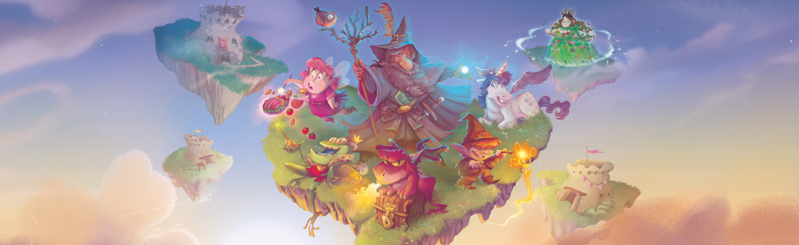

# Prova Finale di Ingegneria del Software - AA 2021-2022

Implementazione del gioco da tavolo [Eriantys](https://www.craniocreations.it/prodotto/eriantys/).

## Documentazione

### UML

- [UML Iniziale](deliveries/UML/UML_Iniziale/UML_Iniziale.jpg)

## Componenti del gruppo
- [_Roberto Cialini_](https://github.com/RobertoCialini)
- [_Umberto Colangelo_](https://github.com/umbertocolangelo)
- [_Vittorio La Ferla_](https://github.com/vittoriolaferla)

## Funzionanlità implementate

| Functionality   |                       State                        |
|:----------------|:--------------------------------------------------:|
| Basic rules     | 🟢 |
| Complete rules  | 🟢 |
| Character Cards | 🟢 |
| Socket          | 🟢 |
| GUI             | 🟡 |
| CLI             | 🟡 |
| Resilience      | 🔴 |
| Persistence     | 🟡 |
